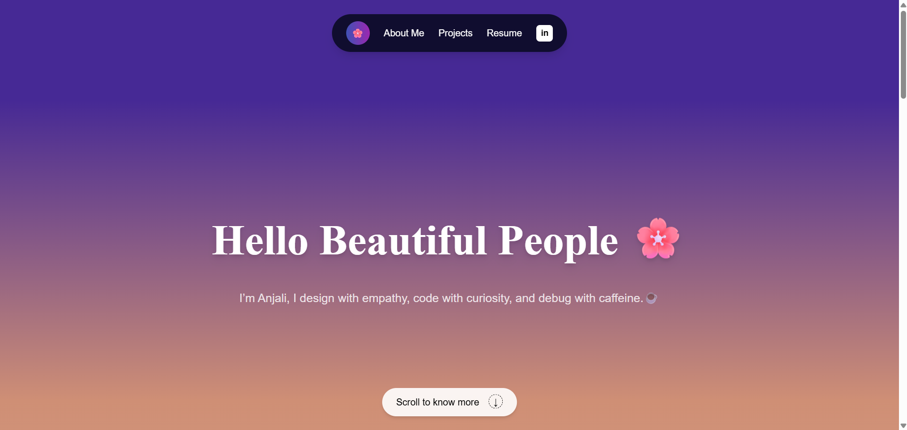
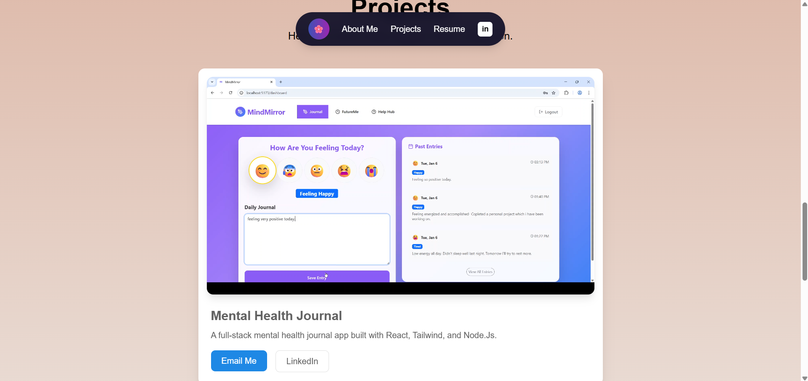

🌸 Personal Portfolio Website

A modern, responsive personal portfolio website built using React and Tailwind CSS.
This project showcases my work, skills, and experience as a Frontend Developer, with a focus on clean UI, smooth interactions, and a minimal design aesthetic.

✨ Features

⚛️ Built with React

🎨 Styled using Tailwind CSS

📱 Fully responsive design

🧭 Smooth scrolling navigation

🪟 Modern glassmorphism-style navbar

💼 Projects section with interactive cards

📬 Contact section with social links

🛠 Tech Stack

React (Vite)

Tailwind CSS

JavaScript (ES6+)

HTML5 & CSS3

Getting Started

Follow these steps to run the project locally:

1. Clone the repository
git clone https://github.com/your-username/my-portfolio.git

2. Navigate to the project
cd My-Portfolio

3. Install dependencies
npm install

4. Start the development server
npm run dev

Open your browser and go to:

http://localhost:5173

📸 Preview

